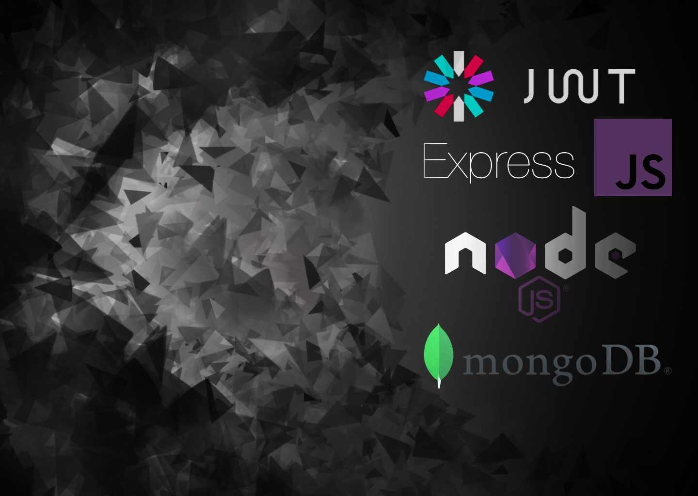

<h1 align="center"><b>Login API with JWT authentication</b></h1>

**A login RESTFul API that uses Node.js and the Express framework along with JWT for authentication**

**Features**

* NodeJS
* Express
* MongoDB
* JWT

**Requirements**

* [Node & Npm](https://nodejs.org/en/)
* [Git](https://git-scm.com/)
* [MongoDB Cluster](https://docs.atlas.mongodb.com/tutorial/create-new-cluster/)
* [Postman](https://www.postman.com/downloads/)

**Instalation**

* `git clone https://github.com/ThiagoBastosN/LoginRESTFulAPI.git`
* `cd loginrestfulapi`
* `npm install`
* Inside .env, change DATABASE_URI to your cluster URI
* `npm start`
* You may also want to add _.env_ to _.gitignore_

# Routes

At http://localhost:3000/ you'll have some route options.

`GET` routes

* http://localhost:3000
  * /retrieveDb
  * /main
    * Requires authentication header and a toke that comes in /login response, the format must be **Bearer yourtoken**

**Notice that /main route requires authentication.**

`POST` routes

* http://localhost:3000
  * /register
    * Body content: `{"username": yourusername, "password": yourpassword}`
  * /login
    * Body content: `{"username": yourusername, "password": yourpassword}`
